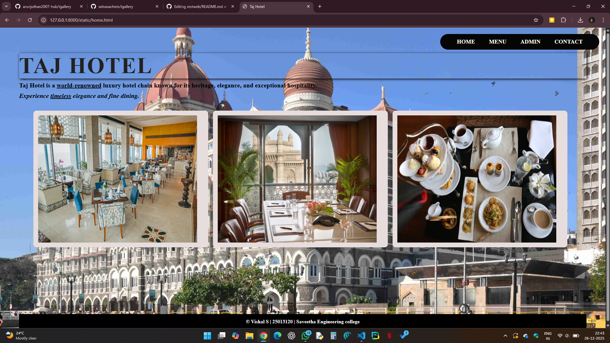
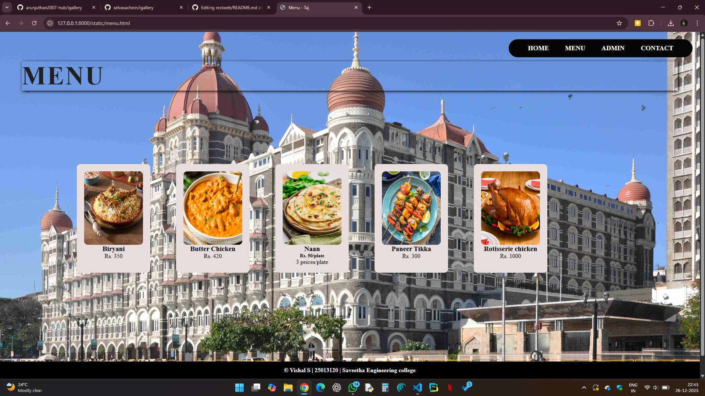
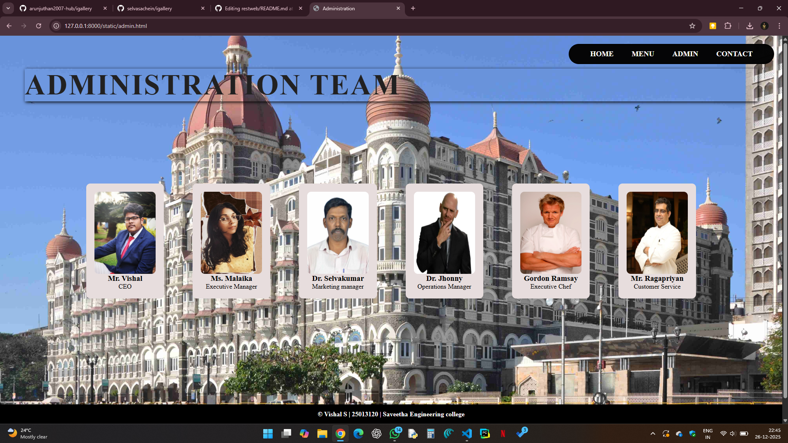
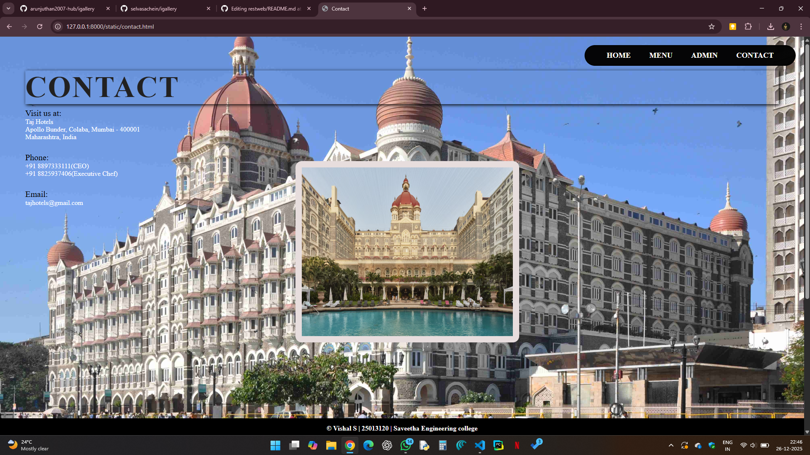

# Ex.06 Restaurant Website
## Date: 26.12.2025

## AIM:
To develop a static Restaurant website to display the food items and services provided by them.

## DESIGN STEPS:

### Step 1:
Requirement collection.

### Step 2:
Creating the layout using HTML and CSS.

### Step 3:
Updating the sample content.

### Step 4:
Choose the appropriate style and color scheme.

### Step 5:
Validate the layout in various browsers.

### Step 6:
Validate the HTML code.

### Step 7:
Publish the website in the given URL.

## PROGRAM:
1) Home.html
```
<html>
<head>
    <title>Taj Hotel</title>
    <link rel="stylesheet" href="style.css">
</head>
<body>

<div class="hotel">
    <div class="navbar">
        <a href="home.html">HOME</a>
        <a href="menu.html">MENU</a>
        <a href="admin.html">ADMIN</a>
        <a href="contact.html">CONTACT</a>
    </div>

    <h1 class="big-title">TAJ HOTEL</h1>
    <p class="subtitle"><b>Taj Hotel is a <u>world-renowned</u> luxury hotel chain known for its heritage, elegance, and exceptional hospitality.</b></p>
    <p class="subtitle"><i><b>Experience <u>timeless</u> elegance and fine dining.</b></i></p>

    <div class="entry">
            
    </div>
    <div class="entry2">
        
    </div>
    <div class="entry3">
        
    </div>

    <div class="footer">
    <footer>
        <b>&copy; Vishal S | 25013120 | Saveetha Engineering college</b>
    </footer>
    </div>

</div>

</body>
</html>
```
2) Menu.html
```
<html>
<head>
    <title>Menu - Taj</title>
    <link rel="stylesheet" href="style.css">
</head>
<body>

<div class="hotel">
    <div class="navbar">
        <a href="home.html">HOME</a>
        <a href="menu.html">MENU</a>
        <a href="admin.html">ADMIN</a>
        <a href="contact.html">CONTACT</a>
    </div>

    <h1 class="big-title">MENU</h1>

    <div class="card-container">
        <div class="card">
            
            <h3>Biryani</h3>
            <p>Rs. 350</p>
        </div>

        <div class="card">
            
            <h3>Butter Chicken</h3>
            <p>Rs. 420</p>
        </div>

        <div class="card">
            
            <h3>Naan</h3>
            <h5 align="center">Rs. 50/plate</h5>
            <p>3 peices/plate</p>
        </div>
        <div class="card">
            
            <h3>Paneer Tikka</h3>
            <p>Rs. 300</p>
        </div>
        <div class="card">
            
            <h3>Rotisserie chicken</h3>
            <p>Rs. 1000</p>
        </div>
        </div>
</div>

<footer>
&copy; Vishal S | 25013120 | Saveetha Engineering college
</footer>

</body>
</html>

```
3) Admin.html
```
<html>
<head>
    <title>Administration</title>
    <link rel="stylesheet" href="style.css">
</head>
<body>

<div class="hotel">
    <div class="navbar">
        <a href="home.html">HOME</a>
        <a href="menu.html">MENU</a>
        <a href="admin.html">ADMIN</a>
        <a href="contact.html">CONTACT</a>
    </div>

    <h1 class="big-title">ADMINISTRATION TEAM</h1>

    <div class="card-container">
        <div class="card">
            
            <h3>Mr. Vishal</h3>
            <p>CEO</p>
        </div>

        <div class="card">
            
            <h3>Ms. Malaika</h3>
            <p>Executive Manager</p>
        </div>
        <div class="card">
            
            <h3>Dr. Selvakumar</h3>
            <p>Marketing manager</p>
        </div>
        <div class="card">
            
            <h3>Dr. Jhonny</h3>
            <p>Operations Manager</p>
        </div>
        <div class="card">
            
            <h3>Gordon Ramsay</h3>
            <p>Executive Chef</p>
        </div>
        <div class="card">
            
            <h3>Mr. Ragapriyan</h3>
            <p>Customer Service</p>
        </div>
        

        </div>
    </div>
</div>

<footer>
&copy; Vishal S | 25013120 | Saveetha Engineering college
</footer>

</body>
</html>

```
4) Contact.html
```
<html>
<head>
    <title>Contact</title>
    <link rel="stylesheet" href="style.css">
</head>
<body>

<div class="hotel">
    <div class="navbar">
        <a href="home.html">HOME</a>
        <a href="menu.html">MENU</a>
        <a href="admin.html">ADMIN</a>
        <a href="contact.html">CONTACT</a>
    </div>

    <h1 class="big-title">CONTACT</h1>

    <p class="subtitle">Visit us at:</p>
    <p>
    Taj Hotels<br>
    Apollo Bunder, Colaba, Mumbai - 400001<br>
    Maharashtra, India
    </p>

    <br>

    <p class="subtitle">Phone:</p>
    <p>+91 8897333111(CEO)<br>
        +91 8825937406(Executive Chef)

    </p>

    <br>

    <p class="subtitle">Email:</p>
    <p>tajhotels@gmail.com</p>
</div>
<div class="exit">
    
</div>

<footer>
&copy; Vishal S | 25013120 | Saveetha Engineering college
</footer>

</body>
</html>

```
5) Style.css
```
* {
    margin: 0;
    padding: 0;
    box-sizing: border-box;
}

body {
    background-color: #000;
    color: #fff;
}

.navbar {
    position: absolute;
    top: 20px;
    right: 20px;
    background: rgba(3, 3, 3, 0.986);
    padding: 12px 30px;
    border: 2px solid #000;
    border-radius: 30px;
}

.navbar a {
    margin: 20px;
    text-decoration: none;
    color: white;
    font-weight: bold;
    font-size: 18px;
}


.hotel {
    height: 100vh;
    background: url("taj.jpg") no-repeat center/cover;
    padding: 80px 60px;
}

.big-title {
    box-shadow: 2px 2px 8px #000;
    font-size: 70px;
    color: rgb(34, 33, 33);
    letter-spacing: 3px;
}

.subtitle {
    margin-top: 10px;
    font-size: 20px;
    color: black;
}


.card-container {
    display: flex;
    gap: 70px;
    padding: 150px;
    margin-top: 50px;
}

.card {
    position: relative;
    background: rgb(231, 221, 221);
    color: #000;
    padding: 20px;
    width: 200px;
    border-radius: 10px;
    text-align: center;
    gap: 100px;
}

.card img {
    width: 100%;
    height: 200px;
    border-radius: 10px;
}

.entry {
    position: relative;
    left: 45px;
    bottom: -35px;
    background: rgb(231, 221, 221);
    color: #000;
    padding: 15px;
    width: 550px;
    border-radius: 10px;
    right: 350px;
}

.entry2 {
    position: relative;
    left: 610px;
    bottom: 395px;
    background: rgb(231, 221, 221);
    color: #000;
    padding: 15px;
    width: 550px;
    border-radius: 10px;

}

.entry3 {
    position: relative;
    left: 1175px;
    bottom: 825px;
    background: rgb(231, 221, 221);
    color: #000;
    padding: 15px;
    width: 550px;
    border-radius: 10px;
}

.exit {
    position: relative;
    left: 700px;
    bottom: 650px;
    background: rgb(231, 221, 221);
    color: #000;
    padding: 15px;
    width: 530px;
    border-radius: 15px;
}

footer {
    position: relative;
    width: 100%;
    margin: 0;
    padding: 15px;
    box-sizing: border-box;
    text-align: center;
    bottom: 470px;
    color: white;
    background: black;
}
```

## OUTPUT:








## RESULT:
The program for designing software company website using HTML and CSS is completed successfully.
